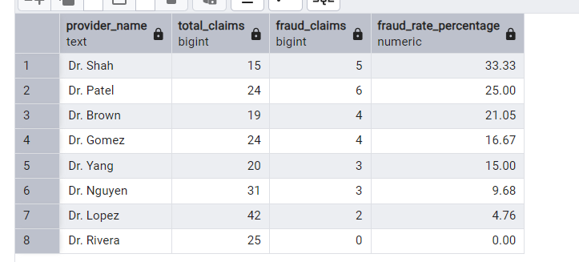
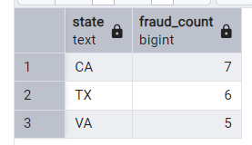
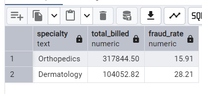

# Healthcare Fraud & High-Cost Claim Analysis

##  📌 Project Overview
This project analyzes a synthetic healthcare claims dataset to identify fraud patterns, high-cost claims, and specialty-level trends.
Using **SQL** for data extraction and **PostgreSQL** functions for calculations, I explored fraudulent claim rates, billing patterns, and state-by-state variations.

The goal was to demonstrate **data analysis, SQL querying, and analytical storytelling** skills in a healthcare context.

---

## 🎯 Objectives
- Calculate the overall fraud rate and compare it to specialty-level fraud rates.
- Identify providers with high claim volumes and/or high fraud percentages.
- Highlight states with the highest fraud counts and billing totals.
- Create actionable insights for detecting fraud risk areas.


---


##  🗂  Dataset
The dataset used for this analysis is a synthetic healthcare claims dataset modeled after real-world claim structures.


**Key tables**
- **claims_data** - Claim ID, provider ID, Billed amount, fraud indicator.
- **providers** - Provider name, specialty, provider ID.
- **patients** - Patient demographic information including state.


  ---

  ##  🛠 Tools & Skills Used
  - **SQL (PostgreSQL)** - Joins, filtering, aggregation HAVING clauses, Common Table Expressions (CTEs), filtering 'FILTER' clauses.
  - **Data Cleaning & Transformation** - Removing invalid values, grouping, calculating percentages.
  - **Analytical Thinking** - Turning raw claims data into insights.
  - **Github** - Project documentation and version control.

  ---

  ##  📊 Key Queries & Results

  ### 1. Provider Fraud Rate Ranking
  ```sql
  SELECT p.provider_name, COUNT(*) AS total_claims,
    COUNT(*) FILTER (WHERE c.is_fraudulent) AS fraud_claims,
    ROUND(COUNT(*) FILTER (WHERE c.is_fraudulent) * 100.0 / COUNT(*), 2) AS fraud_rate_percentage
  FROM claims_data c
  JOIN providers p
    ON c.provider_id = p.provider_id
  GROUP BY p.provider_name
  ORDER BY fraud_rate_percentage DESC;
  ```



  **Insight:** Dr Shah has the highest fraud rate at **33.33%**

  ### 2. States with the Highest Fraudulent Claims

  ```sql
  SELECT p state, COUNT(*) FILTER (WHERE c.is_fraudulent) AS fraud_count
  FROM claims_data c
  JOIN patients p
    ON c.patient_id = p.patient_id
  GROUP BY p.state
  ORDER BY fraud_count DESC
  LIMIT 3;
  ```



  **Insight:** **California, Texas, and Virginia has the highest number of fraudulent claims**

  ### 3.Specialties Above Average Fraud Rate

  ```sql
  WITH overall_rate AS(
    SELECT ROUND(COUNT(*) FILTER (WHERE is_fraudulent) * 100.0 / COUNT(*), 2) AS avg_fraud_rate
  FROM claims_data
  ),
  specialty_rates AS(
    SELECT p.specialty, SUM(c.billed_amount) AS total_billed,
    ROUND(COUNT(*) FILTER (WHERE c.is_fraudulent = TRUE) * 100.0 / COUNT(*), 2) AS fraud_rate
  FROM claims_data c
  JOIN providers p
    ON c.provider_id = p.provider_id
  GROUP BY p.specialty
  )
  SELECT s.specialty, s.total_billed, s.fraud_rate
  FROM specialty_rates s
  JOIN overall_rate o ON TRUE
  WHERE s.fraud_rate > o.avg_fraud_rate
  ORDER BY s.total_billed DESC
  LIMIT 3;
  ```



  **Insight** **Orthopedics and Dermatology had fraud rates higher than the overall average, with Orthopedics leading in total billed amount.**

## 💡 Conclusions
- Fraud Risk Areas - Certain providers and specialties consistently show above-average fraud rates.
- Geographic Trends - Fraudulent claims are concentrated in a few states, which could be prioritized for audit.
- Financial Impact - High-cost specialties with higher fraud rates pose a significant financial risk.
  
