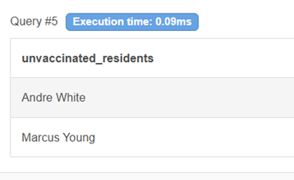
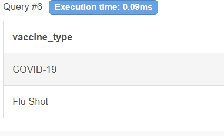
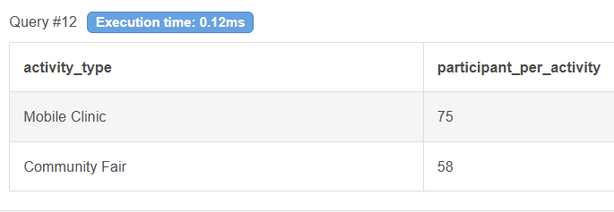

# Public Health Vaccination Outreach Analysis

## Project Overview

This project analyzes vaccination and community outreach data for a county public health initiative focused on increasing vaccination rates in underserved communities.

Using SQL, the analysis identifies residents who have not yet been vaccinated, summarizes vaccination activity across clinics, evaluates outreach event participation, and highlights geographic trends in vaccination coverage.

The goal of this project is to demonstrate how data analysis can support public health decision-making and resource allocation.

---

## Business Scenario

The county’s Data & Evaluation team needs insights to guide vaccination outreach campaigns and improve community engagement.

Key objectives include:

- Identifying residents who have not received any vaccinations
- Understanding which vaccines are being administered
- Cleaning outreach activity data
- Measuring vaccination coverage by ZIP code
- Evaluating participation levels across outreach event types

---

## Dataset

The dataset consists of three tables:

### Resident
Stores demographic information for county residents.

- resident_id
- full_name
- age
- gender
- zip_code

### VaccinationEvent
Tracks vaccination records for residents.

- event_id
- resident_id
- vaccine_type
- clinic_location
- vaccination_date

### OutreachActivity
Tracks community outreach events organized by the public health department.

- outreach_id
- zip_code
- activity_type
- activity_date
- participants

---

# SQL Analysis

## 1. Identify residents without vaccinations

```sql
SELECT r.full_name AS unvaccinated_resident
FROM Resident r
LEFT JOIN VaccinationEvent v
ON r.resident_id = v.resident_id
WHERE v.resident_id IS NULL;
```



This query identifies residents who have not received any recorded vaccinations.


---

## 2. List distinct vaccine types administered

```sql
SELECT DISTINCT vaccine_type
FROM VaccinationEvent;
```



This query identifies all unique vaccine types administered across clinics.


---

## 3. Data cleanup: remove outreach activities with low participation

First identify the records:

```sql
SELECT *
FROM OutreachActivity
WHERE participants < 30;
```

Then remove them:

```sql
DELETE FROM OutreachActivity
WHERE participants < 30;
```

This step ensures the dataset excludes outreach events with very low participation.

---

## 4. Count vaccinated residents by ZIP code

```sql
SELECT r.zip_code,
       COUNT(DISTINCT r.resident_id) AS residents_per_zip
FROM Resident r
JOIN VaccinationEvent v
ON r.resident_id = v.resident_id
GROUP BY r.zip_code;
```


This query summarizes vaccination coverage across ZIP codes.

---

## 5. Participation by outreach activity type

```sql
SELECT activity_type,
       SUM(participants) AS participants_per_activity
FROM OutreachActivity
GROUP BY activity_type
ORDER BY participants_per_activity DESC;
```



This query evaluates which outreach events generated the highest engagement.

---

# Key Insights

- Two residents in the dataset had not received any vaccinations and could be prioritized for outreach campaigns.
- Two vaccine types were administered across the clinics: COVID-19 and Flu Shot.
- Outreach events with fewer than 30 participants were removed to maintain data quality.
- ZIP code **30001** had the highest number of vaccinated residents.
- **Mobile Clinic events generated the highest engagement**, with the largest total number of participants.

---

# Skills Demonstrated

- SQL Joins
- Filtering with NULL conditions
- DISTINCT queries
- Data cleaning with DELETE
- Aggregation using COUNT and SUM
- GROUP BY and ORDER BY
- Translating business questions into SQL analysis
